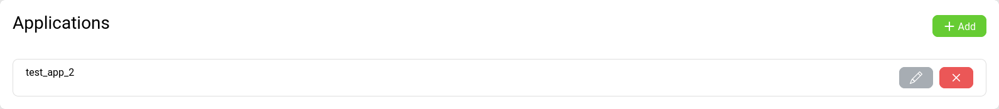
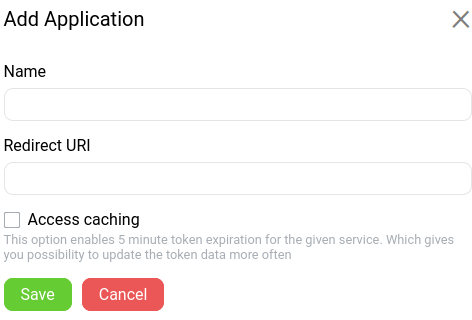
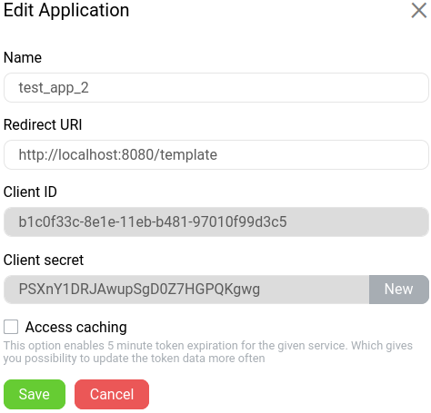

---

# Get-Net SignIn Widget
This library gives you a customizable login widget, that can be used to authenticate users on your web application

## Get started
To use this library you need to do the following steps:
1. Visit our [kyc service](https://id.gtn.ee/)
2. Create your own application


3. Provide redirect uri, its the base url of your app, where widget is gona be used
4. After app is created you can click on edit icon add see a client ID, it will be needed later



## Installation
Using npm:

```bash
    npm install gtn-signin-widget
```
Import the module
```js
    // ES module
    import { SignInGTN } from 'gtn-signin-widget'
    const widget = new SignInGTN({
        // config
    })
```

Using unpkg
```html
    <script src="https://unpkg.com/gtn-signin-widget@latest/public/build/bundle.js"></script>
```
Instance of SignInGTN avaliable globally
```js
    const widget = new SignInGTN({
        // config
    })
```

## Usage
You must provide configuration object and callbacks to SignInGTN instance:

```js
    let widgetConfig = {
        client_uid: "your client id",
        appearance: {
            logo: {
                src: "https://www.get-net.ru/img/logo.png",
                width: "400px"
            },
            signInFormText: "Get-Net Sign in",
            signUpFormText: "Get-Net Sign Up",
            width: "500px" //total widget width
        },
        lang: "en", //or ru
        features: {
            registration: true, //registration feature is optional
            rememberMe : true   //remember me feature is optional
        }
    }

    const successCallback = function() {
        //your success logic goes here
    }
    const errorCallback = function(error) {
        //your error logic goes here
    }
    const widget = new SignInGTN(widgetConfig, successCallback, errorCallback)
```

To render widget use renderEl function of created instance:
```js
    const widget = new SignInGTN(widgetConfig, scal, ercal)

    widget.renderEl("app") //optional id
```
Widget will be rendered inside the html element with id="app"

### Get Token
```js
    const token = widget.getToken()
```

### Get UserInfo
```js
    const userInfo = widget.getUserInfo()
```

### Logout
```js
    widget.logout()
```

You can acces widget globally trough window object
```js
    let widget = window.$gtn_widget
```
## Styling
Apply default style for widget:
using npm:
```js
    import 'gtn-signin-widget/public/build/bundle.css'
```
using unpkg:
```html
    <link rel="stylesheet" href="https://unpkg.com/gtn-signin-widget@latest/public/build/bundle.css"
```
### Override default styles
All ui elements of widget are inherited from gtn-widget-wrapper class

input elements have widget-input class 

For more detail information watch repository